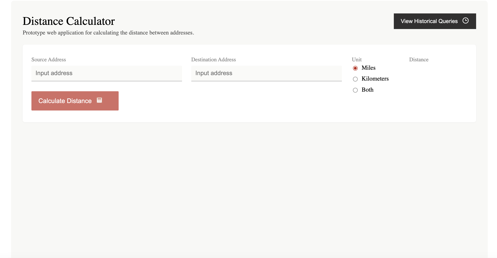
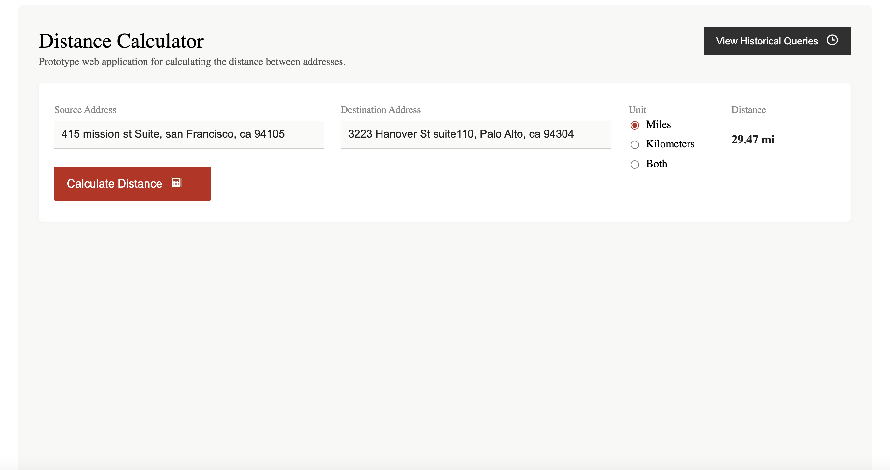
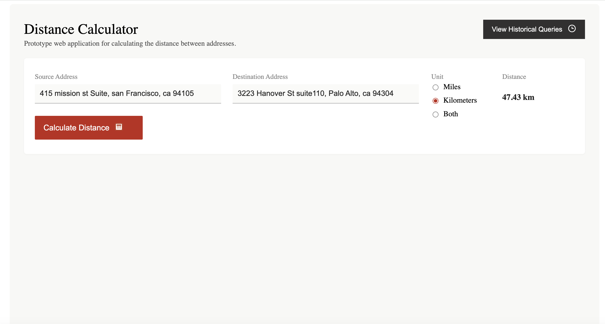
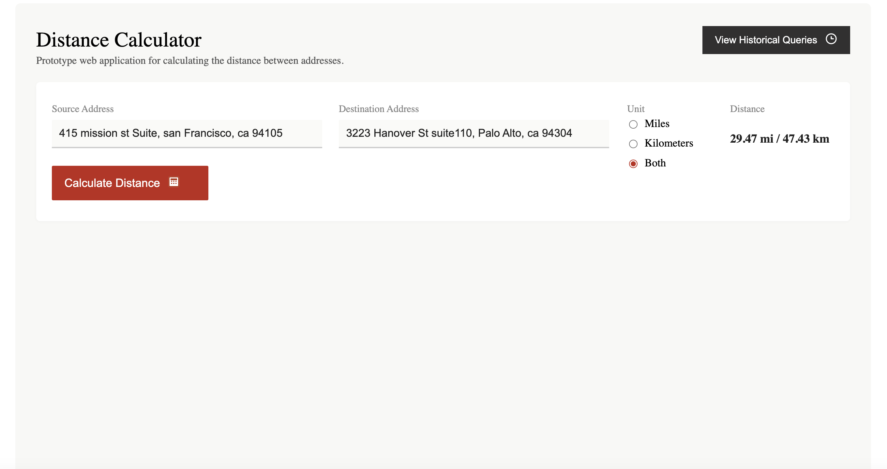
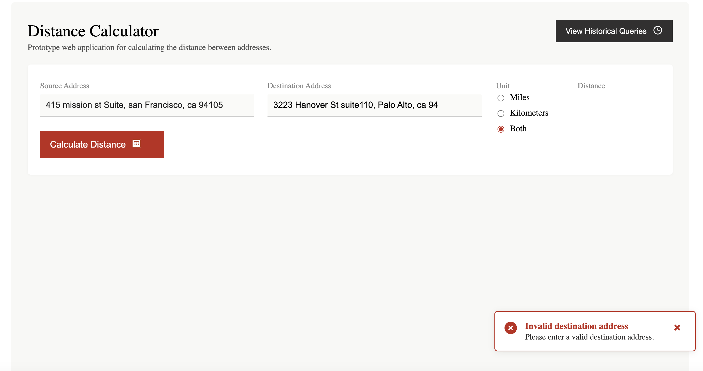
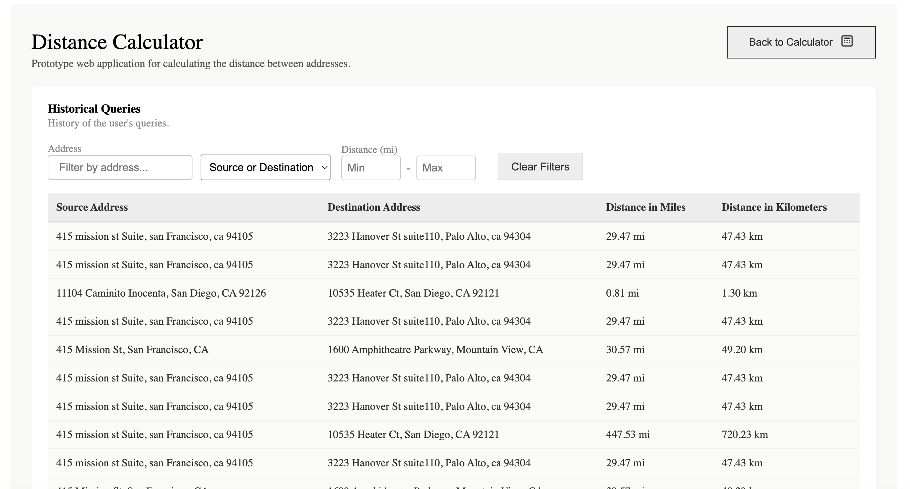
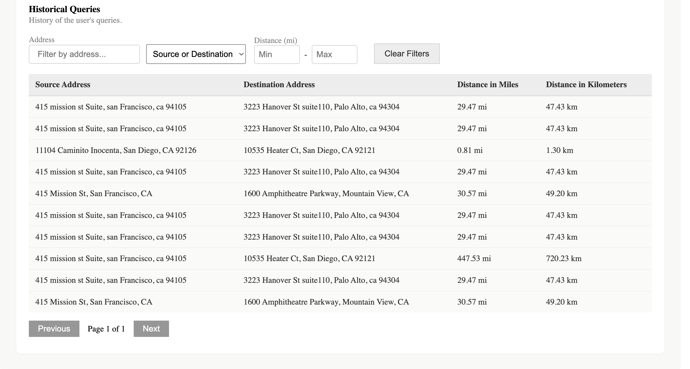

# FarFetchr: Distance Calculator Web App

---

## Project Highlights

- **Robust local development with Docker Compose.**
- **Secure, environment-variable-based configuration.**
- **Automated database initialization.**
- **Production-ready cloud deployment (Vercel + Render).**
- **Live, public URLs:**
  - Frontend: [https://far-fetchr.vercel.app/](https://far-fetchr.vercel.app/)
  - Backend API docs: [https://farfetchr-backend.onrender.com/docs](https://farfetchr-backend.onrender.com/docs)

## Screenshots

### Main App Screens


*Main landing page of FarFetchr*


*Calculating distance in miles*


*Calculating distance in kilometers*


*Calculating distance in both miles and kilometers*

### Error Handling


*Error message for invalid or missing source address*


*Error message for invalid or missing destination address*

### History & Filtering


*Viewing and filtering query history*


*Paginated history of previous queries*

---

## Quick Start: Fullstack with Docker Compose

1. **Environment Setup (Required First!)**

   Copy the example environment files and fill in your own values:
   ```bash
   cp .env.example .env
   cp backend/.env.example backend/.env
   cp backend/.env.example backend/.env.docker
   ```
   Edit `.env`, `backend/.env`, and `backend/.env.docker` to set your own secrets and configuration.
   **Do NOT commit your real `.env` files to git.** Only commit the `.env.example` files as templates.

   > **Important:**
   > The `POSTGRES_USER`, `POSTGRES_PASSWORD`, and `POSTGRES_DB` in your `.env` file are now used by both the database and backend automatically via Docker Compose. You can use any values you like—just set them in `.env` and do not hardcode them elsewhere. The backend and database will always be in sync.

2. **Build and start everything:**
   ```bash
   docker-compose up --build
   ```
   - Frontend: http://localhost:4173
   - Backend: http://localhost:8000
   - Database: persists in Docker volume `pgdata`

3. **Reset the database (start fresh):**
   ```bash
   docker-compose down -v
   docker-compose up --build
   ```
   This will remove all data and reinitialize the DB.

4. **Connect to the database with DBeaver or any other database client:**
   - Host: `localhost`
   - Port: `5432`
   - Database: (use the value of `POSTGRES_DB` from your `.env`)
   - User: (use the value of `POSTGRES_USER` from your `.env`)
   - Password: (use the value of `POSTGRES_PASSWORD` from your `.env`)
   > These values are set in your `.env` file. Change them as needed for your environment.
   > Ensure your local Postgres is stopped to avoid port conflicts.

5. **No manual DB initialization needed!**
   - The backend automatically creates tables on startup.

6. **Troubleshooting:**
   - If you see old data after restart, use `docker-compose down -v` to clear the DB.
   - If you get connection errors, ensure no other service is using port 5432.

## Environment Setup

1. Copy the example environment files and fill in your own values:
   ```bash
   cp .env.example .env
   cp backend/.env.example backend/.env
   cp backend/.env.docker.example backend/.env.docker
   ```
2. Edit `.env` and `backend/.env` to set your own secrets and configuration.
3. **Do NOT commit your real `.env` files to git.** Only commit the `.env.example` files as templates.

---

## Advanced/Manual Development (Optional)

If you want to run backend and frontend locally (not recommended for most users):

1. **Backend:**
   - Set up Python venv, install requirements, configure `.env`, and run `uvicorn main:app --reload` as before.
2. **Frontend:**
   - Run `npm install` and `npm run dev` as before.

> **Note:** You must manually initialize the DB if not using Docker Compose.

## Features
- **Distance Calculation:** Enter a source and destination address to calculate the distance in miles, kilometers, or both.
- **Geocoding:** Uses OpenStreetMap Nominatim to convert addresses to coordinates.
- **Error Handling:** Robust validation and user-friendly error messages for invalid or missing addresses, network issues, and geocoding failures.
- **Query History:** Stores the last 20 successful queries in the browser's local storage. View historical queries in a sortable table.
- **Responsive Design:** Fully adapts to all screen sizes, ensuring usability on desktops, tablets, and smartphones.
- **Accessible UI:** Proper label associations, keyboard navigation, and color contrast.
- **Modern UX:** Loading spinners, animated error toasts, and Figma-matching design.

## Use Cases
- Quickly find the driving or straight-line distance between two addresses for travel, logistics, or planning.
- Keep a record of recent distance queries for reference or reporting.
- Use on any device, from desktop to mobile, without loss of functionality.

## Error Checks & Validation
- **Empty Fields:** Prompts user to fill both source and destination.
- **Invalid Format:** Detects addresses that are too short, all numbers, no letters, or only special characters.
- **Identical Addresses:** Prevents calculation if source and destination are the same.
- **Geocoding Failure:** Informs user if the address cannot be found.
- **Network/API Errors:** Notifies user of connectivity issues.
- **All errors are shown in a styled toast notification at the bottom right.**
- **For a full list of error conditions and validation logic, see [`tests/README.md`](tests/README.md).**

## How It Works
- **Main Page:**
  - Enter addresses, select unit, and click "Calculate Distance".
  - The app geocodes both addresses, calculates the distance, and displays the result.
  - Each successful calculation is saved to history.
  - Errors are shown in a toast notification.
- **View Historical Queries:**
  - Click the "View Historical Queries" button to see a table of past queries.
  - Table includes source, destination, and distances in both units.
  - Click "Back to Calculator" to return to the main page.

## Technologies Used
- [SvelteKit](https://kit.svelte.dev/)
- [OpenStreetMap Nominatim API](https://nominatim.openstreetmap.org/)
- [Python](https://www.python.org/)
- [FastAPI](https://fastapi.tiangolo.com/)
- [SQLAlchemy](https://www.sqlalchemy.org/) (async ORM)
- [Pydantic](https://docs.pydantic.dev/) (data validation)
- [asyncpg](https://github.com/MagicStack/asyncpg) (async Postgres driver)
- [PostgreSQL](https://www.postgresql.org/)
- [Uvicorn](https://www.uvicorn.org/) (ASGI server)
- [Starlette](https://www.starlette.io/) (ASGI toolkit)
- [python-dotenv](https://github.com/theskumar/python-dotenv) (env var management)
- [SlowAPI](https://pypi.org/project/slowapi/) (rate limiting)
- [Docker](https://www.docker.com/)
- TypeScript, HTML, CSS

## Testing Stack

- [Vitest](https://vitest.dev/) — Frontend unit testing for SvelteKit and TypeScript code
- [Playwright](https://playwright.dev/) — Frontend end-to-end (E2E) browser testing
- [pytest](https://docs.pytest.org/) — Backend unit and integration testing for Python
- [pytest-asyncio](https://pytest-asyncio.readthedocs.io/) — Async test support for FastAPI and async DB code

## Testing

- **Run all tests (frontend & backend):**
  ```bash
  npm test
  ```
  This command runs both frontend unit tests (Vitest), frontend E2E tests (Playwright), and backend tests (pytest, pytest-asyncio) in sequence.

- **Frontend unit tests only:**
  ```bash
  npm run test:unit
  ```

- **Frontend E2E tests (Docker Compose):**
  Make sure the full stack is running with Docker Compose (`docker-compose up --build`), then run:
  ```bash
  npm run test:e2e:docker
  ```
  This will run Playwright E2E tests against the frontend at `http://localhost:4173`.

- **Backend tests only:**
  From the `backend/` directory, run:
  ```bash
  ./run_tests.sh
  ```
  This will run all backend unit and async tests using pytest and pytest-asyncio.

## Notes

* Data is now stored and retrieved via a FastAPI + PostgreSQL backend.
* The app is for demonstration and prototyping purposes.
* For production use, consider adding authentication, rate limiting, and API keys.

## Backend Setup

To set up and run the FastAPI backend:

1. **Navigate to the backend directory:**
   ```bash
   cd backend
   ```
2. **Create and activate a Python virtual environment:**
   ```bash
   python3 -m venv venv
   source venv/bin/activate
   ```
3. **Install dependencies:**
   ```bash
   pip install -r requirements.txt
   ```
4. **Set up your PostgreSQL database:**
   - Make sure PostgreSQL is running.
   - Create a database (e.g., `farfetchr`).
   - Create a user/role with access to the database.
5. **Configure environment variables:**
   - Create a `.env` file in the `backend/` directory with:
     ```
     DATABASE_URL=postgresql+asyncpg://<username>:<password>@localhost:5432/farfetchr
     ```
     Replace `<username>` and `<password>` with your PostgreSQL credentials.
6. **Initialize the database tables:**
   ```bash
   ./setup.sh
   ```
   (This will create tables and install dependencies if needed.)
7. **Run the FastAPI server:**
   ```bash
   uvicorn main:app --reload
   ```
   The backend will be available at `http://localhost:8000`.

### Test Scripts (from package.json)

You can use the following npm scripts for testing:

- `npm run test:unit` — Runs all unit tests in `tests/unit` using Vitest
- `npm run test:e2e` — Runs all Playwright E2E tests in `tests/e2e`
- `npm test` — Runs both unit and E2E tests in sequence

### Backend Test Script

To run all backend tests from the backend folder, use:
```bash
cd backend
./run_tests.sh
```
See backend/README.md for more details.

## Running Frontend and Backend in Docker (with Host Database)

You can run both the frontend and backend in Docker containers, while using your local PostgreSQL database.

### 1. Start your local PostgreSQL database
- Ensure your database is running and accessible at `localhost:5432`
- The database `farfetchr` and user/password `postgres:grid2home` should exist

### 2. Build and run the backend Docker container (from backend directory)
```bash
cd backend
./run_docker.sh .env.docker
```

### 3. Build and run the frontend Docker container (from project root)
```bash
docker build -t farfetchr-frontend .
docker run -p 4173:4173 farfetchr-frontend
```

### 4. Access the app
- Frontend: http://localhost:4173
- Backend: http://localhost:8000
- API docs: http://localhost:8000/docs

---

## Running the App: Local, Docker Compose, and Manual

### 1. Local Development (manual, with host DB)
- Backend: uses `backend/.env` with `localhost` for DB
- Frontend: runs with Vite/SvelteKit dev server

```bash
# Start PostgreSQL locally (if not already running)
# Start backend
cd backend
python3 -m venv venv
source venv/bin/activate
pip install -r requirements.txt
uvicorn main:app --reload
# In a new terminal, start frontend
cd ..
npm install
npm run dev
```

## Planned: CI/CD Integration

- **Automated Testing:** All unit and E2E tests will run on every push and pull request.
- **Continuous Deployment:** Automatic deployment to Vercel (frontend) and Render (backend) after successful tests.
- **Code Quality:** Linting and formatting checks to maintain code standards.
- **Status Badges:** CI status will be displayed in the README.

> _CI/CD setup (e.g., with GitHub Actions) is planned for future releases._
